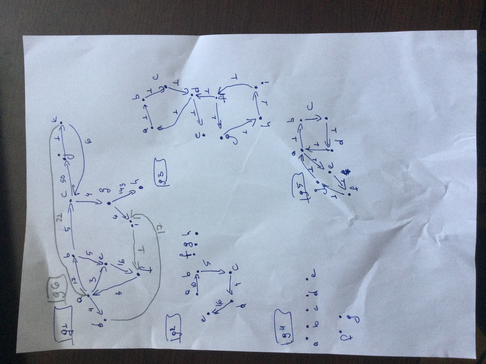

# cityMap


### to-do
- improve
  - abstraction
  - file structure
  - documentation
  - variable names in the famous algorithms like Dijkstra,
there is no need to be named the same as in the pseudocode
- add more test cases
- move tests to a different directory
- test without cluttering the main
- clean up README


SDP project, FMI
### 
### intro tl;dr: skip the intro
As Benjamin Franklin famously wrote in 1789, in a letter to Jean-Baptiste Le Roy, 
who, among other things, was one of the contributors, known as Encyclopédistes,
with 108 articles to  the Encyclopédie, which was co-edited by the famous and
beloved by many students, althought now as much as, among others, Isaac Newton or
Augustin-Louis Cauchy, Jean le Rond d'Alembert, who contributed to the same 
Encyclopédie with 1309 articles, which is an impressive amount, but somewhat
diminished by the 17288 articles, about 1/4,  contributed by the most prolific
Encyclopédistes - Louis de Jaucourt:

```
    Our new Constitution is now established, and has an appearance that promises
    permanency; but in this world nothing can be said to be certain,
    except death and taxes.
```

Anyway.
As I was questioning my approach to solving the given problems in this project,
I thought about other certainties in life, which might help me with my project.
I couldn't find any, but I remembered three, which come as close as it gets:
- If you don't know a word, you can find it in the dictionary.
Here is a good one: https://ibl.bas.bg/rbe/

- If you don't know how to solve an integral, integration by parts.

- If you have a data structures and algorithms problem,
binary search and/or hash tables.

### whats my data structure
Since there are no specific time/memory constraints on the project and considering
that there isn't an uniform solution to various data structure problems I have picked
unordered_map. I though it would have been intresting to use unordered_map instead of
maybe more classical vector of vector for the adjacency table. Plus we already used map
on seminars.
- https://www.bigocheatsheet.com/

Pros:
- average constant search, insertion, delete
- reference/pointer invalidation only on deletion
Cons:
- based on the hashing algorithm used for implementation  search, insertion and deletion
are to O(n)
- complex data structure - memory overhead
- bad locality of reference

```
  using Node = std::string;
  using Distance = int;
  using AdjacentTo = std::unordered_map<Node, Distance>;

  std::unordered_map<Node, AdjacentTo*> nodes;

```
### Why unordered_map(hash table)? Why not map(red-black tree) or vector(dynamic array)?
In different scenarion, different data structures might yield optimal results.
- maps have better worst case insertion/deletion - O(log n)
  - better for reading the adjacency list and checking if an element is already one,
  when adding elements
- vectors have O(1) access
  - better for implementing the algorithms on the graph
  
An optimal solution might consist even of a combination of those. Maybe read the graph
using a map to guarantee insertion/deletion O(log n) and then copy into a vector of 
vectors to guarantee O(1) look up.

For this specific problem, speed isn't crutial so the differences between the suggested
implementation can be considered negligible.

When performance is critical, use of profiling tools is highly recommended.

### Why not use an adjacency matrix?
Because in a city, most of the crossroads aren't adjacent, and the graph would be
too sparse to justify the used memory.

### why are the nodes in AdjacentTo not references/pointers?
std::unordered_map guarantees  ` References and pointers to either key or data
stored in the container are only invalidated by erasing that element, even when
the corresponding iterator is invalidated. ` So the adjacentTo nodes could be
references to the nodes in the nodes map, but too much early optimization
is not cool.
std::string_view can be used to optimize the nodes memory.
~~Plus I don't know how exactly std::string works.
I guess the compiler does a pretty good job at optimising the memory anyway...~~


### make AdjacentTo nodes string_view to save some copies
see one above

### does std::string_view improve something?
I was wondering if string_view does really improve something so, I used time(1)
- https://www.gnu.org/software/time/


` /usr/bin/time -f "real %e\nuser %U\nsys %S\nmem %M\ncpu %P" ./f `

```
       %e     (Not in tcsh(1).)  Elapsed real time (in seconds).
       %U     Total number of CPU-seconds that the process spent in user
              mode.
       %S     Total number of CPU-seconds that the process spent in
              kernel mode.
       Memory
       %M     Maximum resident set size of the process during its
              lifetime, in Kbytes.
              
       %P     Percentage of the CPU that this job got, computed as (%U + %S) / %E.

```
- https://man7.org/linux/man-pages/man1/time.1.html

I did four test of just creating a CityMap object and reading all elements from a file.
Tried with two different test files, generated like this:
```
  int N {1000};

  for (int i{1}; i < N; ++i) {
    std::cout << i << ' ';
    for (int j{1}; j < N; ++j) {
      if (j != i) {
        std::cout << j << ' ' << j << ' ';
      }
    }
    std::cout << std::endl;
  }

```
First was with N = 1000 and second N = 10000


And here are the results (time in s, mem in KB):
```
# N = 1000
# using AdjacentTo = std::unordered_map<Node, Distance>;
real 14.97
user 14.87
sys 0.08
mem 75552
cpu 99%

# N = 1000
# using AdjacentTo = std::unordered_map<std::string_view, Distance>;
real 13.84
user 13.76
sys 0.06
mem 59956
cpu 99%

# N = 1000
# using AdjacentTo = std::unordered_map<std::string_view, Distance>;
# const & all the way

real 10.82
user 10.76
sys 0.04
mem 59972
cpu 99%

# N = 10000
# using AdjacentTo = std::unordered_map<Node, Distance>;
real 1553.97
user 1548.10
sys 3.98
mem 7058168
cpu 99%

# N = 10000
# using AdjacentTo = std::unordered_map<std::string_view, Distance>;

real 1423.62
user 1418.30
sys 3.31
mem 5494924
cpu 99%

# N = 10000
# using AdjacentTo = std::unordered_map<std::string_view, Distance>;
# const & all the way

real 1016.55
user 1013.67
sys 2.16
mem 5495180
cpu 99%


```
```

only string_view vs string:

max memory:
N =  1 000:   59956 / 75552     = 0.79357

N = 10 000: 5494924 / 7058168   = 0.77852

user time:
N =  1 000:  13.76  / 14.87     = 0.92535
N = 10 000: 1418.30 / 1548.10   = 0.91616


string_view and arguments as references vs string and copies:

max memory:
N =  1 000:  59972  / 75552     = 0.79378
N = 10 000: 5495180 / 7058168   = 0.77856

user time:
N =  1 000:  10.76  / 14.87     = 0.72360
N = 10 000: 1013.67 / 1548.10   = 0.65478


```
#### string vs string_view
I got about `20% less max memory` used to store the whole data,
and about  `8% of time improvement` to read the whole data. It's something.

#### string and copies vs string_view and const references
on reading 100M nodes in memory the performance improvement is
about `22% less memory` and `35% faster`.

Copies are so slow...
```
“Immature poets imitate; mature poets steal;"
    - T.S Eliot
```

also I ran g++'s profiler gprof just for fun:
-https://ftp.gnu.org/old-gnu/Manuals/gprof-2.9.1/html_mono/gprof.html#SEC4
### how to run
- `make` runs creates the necessary object and dependencies files,
    compiles, then it runs the tests and runs the program itself
- `make clean` ~~before commiting run  to clean unnecessary files like
    object files and the exe~~ gitignore ignores them anyway
- `make test` to build and run only the test

### make
- https://stackoverflow.com/questions/30573481/path-include-and-src-directory-makefile/30602701
- https://makefiletutorial.com/
- https://www.gnu.org/software/make/manual/make.html

### doctest
- https://github.com/onqtam/doctest 
- commands
    - `./f` runs both doctests and the programme itself
    - `./f -nr` runs only the programme
    - `./f -e` runs only the doctests
    - `./f -ts=graph` runs only tests in suite graph `-ts   --test-suite=<filters>`
    - more commands: https://github.com/onqtam/doctest/blob/master/doc/markdown/commandline.md

### why add path to includes?
- because it helps the autocomplete on my config
   
### how to test private methods with doctest?
- private methods testing workaround https://github.com/onqtam/doctest/issues/427,
but with a friend for better encapsulation

### `make` vs `make all`?
- I thought `make` was an alias for `make all`. It is not. Apparantly make just builds
the first target in the Makefile

### doctest doesn't like logic
These three lines caused a big fuss:
```
    CHECK((d == std::make_pair("a", "d")
           || d == std::make_pair("g", "h")
           || d == std::make_pair("g", "i")));

```

```
$ make 2> err
    echo -Iincludes -Idoctest -MMD -MP
    -Iincludes -Idoctest -MMD -MP
    g++ -Iincludes -Idoctest -MMD -MP -Wall -Werror -std=c++20 -c sources/graph.cpp -o objects/graph.o
$ wc err
  2453  12544 181304 err

```

### a few test might give false negative?
a few tests compare the returned list with prechecked lists of results,
which sort of relies on the deterministic properties of the unordered_map iterator,
but maybe to others too

### Guess closest command with levenshtein distance
Guess the command, the user intended to type with levenshtein distance. Currently the
levenshtein distance function is reccursive and is inpractical for long words...

Update with direct implementation of the pseudocode from wikipedia to improve speed
by a lot - it's now practical for long words
- https://www.wikiwand.com/en/Levenshtein_distance#/Iterative_with_two_matrix_rows

### pseudocode is so annoying...
In this example `for i from 0 to n` includes i == n
- https://www.wikiwand.com/en/Levenshtein_distance#/Iterative_with_two_matrix_rows

but this one ` for k from 1 to K` doesn't include k == K
- https://www.wikiwand.com/en/Yen%27s_algorithm


### Dijkstra?
- https://cp-algorithms.com/graph/dijkstra_sparse.html

### Yen
- https://www.wikiwand.com/en/Yen%27s_algorithm

### Hierholzer
- https://www.youtube.com/watch?v=8MpoO2zA2l4&ab_channel=WilliamFiset
### best bug yet
Spent a few hours searching for a std::bad_alloc error because I misinterpreted
a pseudocode for loop, adding an extra iteration in some cases...
I had written this:

```
  for i from 0 to size(A[k − 1]) − 2:
```
like this:
```
    for (int i{}; i < size - 1; ++i) {
```
instead of this:
```
    for (int i{}; i < size - 2; ++i) {
```

### to do
- wrap
- exceptions
- input validation

# the 7 requirements

### 1. is there a path between two nodes?
- BFS:
```
bool isPath(Node from, std::optional<Node> to = std::optional<Node>())

```
### 2. k-th shortest paths
- Yen's algorihtm with Dijkstra:
  - note: Yen's algorithm doesn't count loops
```
std::vector<Path> kTHShortestPath(Node from, Node to, int K, std::set<Node>
                                    nodesToIgnore = std::set<Node>());
```


### 3. k-th shortest paths with list of closed
- same as 2: Yen's:
  - note: Yen's algorithm doesn't count loops
```
std::vector<Path> kTHShortestPath(Node from, Node to, int K, std::set<Node>
                                    nodesToIgnore = std::set<Node>());
```

### 4. is there a loop starting given node?
- BFS from 1. :
```
bool isPath(Node from, std::optional<Node> to = std::optional<Node>())

```
### 5. find Euler's cycle
- Hierholzer's algorithm: 
```
Path findEulerianPath(std::unordered_set<Node> nodesToIgnore =
                      std::unordered_set<Node>());


```
- if we need a cycle, the first and last elements of the list, should be the same

### 6. is Mother? (there is a path from it to all the rest)
- same as 1. and 4. BFS:
```
bool isPath(Node from, std::optional<Node> to = std::optional<Node>())
```

### 7. find all dead ends
- get all the nodes with no adjacent to nodes. check if any node 
is adjacent to one of those:
```
std::list<std::pair<std::string, std::string>> getDeadEnds()
```
